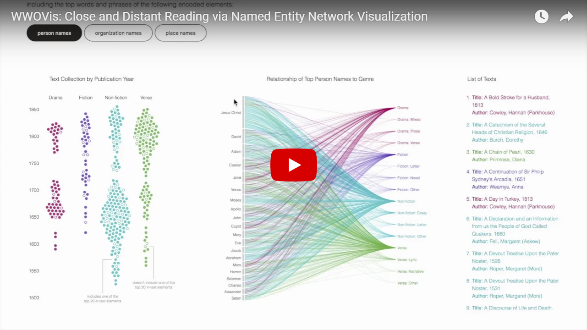

# WWOVis

This visualization represents the textbase of women writers online, a collection of 401 electronically-encoded historical texts by women writers. The right-sided visualization shows a holistic view of the collection by genre and publication year. The center visualization is a bipartite network showing the relationship of words and phrases of a particular in-text element to the genre of the text it resides in. Four in-text elements are included in the visualization and are populated by clicking the respective button. The third piece is a list of the texts included in the collection. The intention is that with increased user interaction, the user can filter down to a smaller number of texts and can see them in the right column.

# Demo

You can see a live demo at [www.wwp.northeastern.edu/wwo/lab/names-viz](https://www.wwp.northeastern.edu/wwo/lab/names-viz/index.html) or [visdunneright.github.io/WWOVis](https://visdunneright.github.io/WWOVis/) and watch our demo video: 

# Setup
- Open terminal/command prompt.
- Fork and clone the github repository to your local system in a dedicated folder.
- Change to the public directory.
- At the command line, run python -m http.server with the version Python 3. 
- Visit [http://localhost:8000/](http://localhost:8000/) in your browser.

# Publication 

Sarah Campbell, Zheng-yan Yu, Sarah Connell, and Cody Dunne, "Close and Distant Reading via Named Entity Network Visualization: A Case Study of Women Writers Online", Proc. 3rd Workshop on Visualization for the Digital Humanities. VIS4DH. 2018.

# Authors
[Sarah Campbell](https://www.linkedin.com/in/sarahlizcampbell/), [Zheng-yan Yu](https://noelfish6.github.io/), [Sarah Connell](https://library.northeastern.edu/about/library-staff-directory/sarah-connell), and [Cody Dunne](https://cody.ccis.northeastern.edu/)

Northeastern University [Data Visualization @ CCIS](https://visualization.ccis.northeastern.edu/), [College of Art Media and Design](https://camd.northeastern.edu/artdesign/academic-programs/mfa-in-information-design-and-visualization/), and [Digital Scholarship Group](https://dsg.neu.edu/).

# License
This project is licensed under the MIT License.
